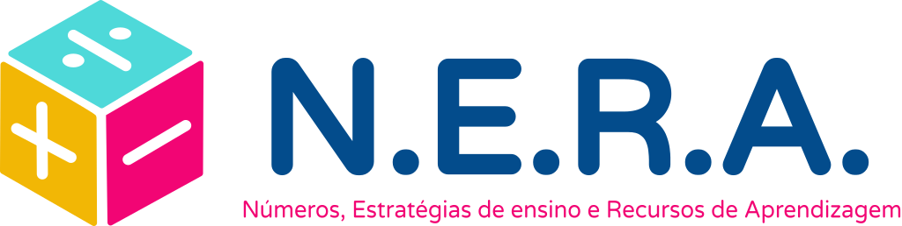

# Landing Page do jogo "Batalha Matemática: Adição vs. Subtração"

[Link do site](https://amandasribeiro.github.io/LandingPage-Jogo/)
 
 
A landing page apresenta o jogo "Batalha Matemática: Adição vs. Subtração" como uma experiência educativa e divertida para crianças e jovens praticarem habilidades de adição e subtração. Ela fornece informações sobre como o jogo funciona, seus objetivos e a equipe por trás do desenvolvimento, sendo direcionada a estudantes que desejam melhorar suas habilidades matemáticas de forma envolvente.

## Demonstração

Insira um gif ou um link de alguma demonstração

## Autores

- [@amandaSribeiro](https://github.com/amandaSribeiro)
- [@KedssonFigueredo](https://github.com/KedssonFigueredo)
- [@Larissaribeiro03](https://github.com/Larissaribeiro03)
- [@thaisperlho](https://github.com/thaisperlho)
- [@ViniciusCalo](https://github.com/ViniciusCalo)

## Manual de Desenvolvimento do jogo

Para obter informações detalhadas sobre como desenvolver para o Projeto Nera, consulte nosso [Manual de Desenvolvimento em PDF] (link para o manual em PDF).

## Projeto N.E.R.A.
O Projeto N.E.R.A. é uma iniciativa inovadora que combina gamificação com o ensino de matemática. Este projeto oferece uma plataforma interativa repleta de jogos, desafios e atividades envolventes que tornam o aprendizado da matemática mais divertido e eficaz. Além de melhorar a motivação dos alunos, o N.E.R.A. promove o aprendizado autônomo, fornecendo feedback imediato e instruções personalizadas. Com uma equipe dedicada e apaixonada, o Projeto N.E.R.A. tem como objetivo transformar a forma como a matemática é ensinada e aprendida, visando melhorar as habilidades dos alunos e sua confiança na disciplina. Siga-nos nas redes sociais para fazer parte dessa jornada educativa emocionante.

- [Instagram](https://www.instagram.com/nera.projeto/)
 
 

   
© [N.E.R.A.]

